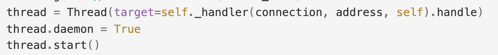
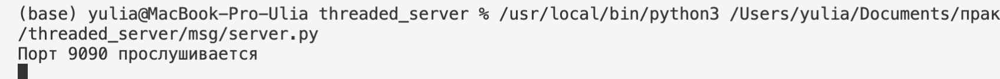
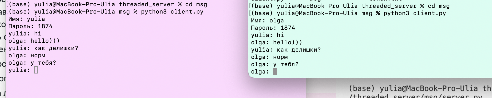
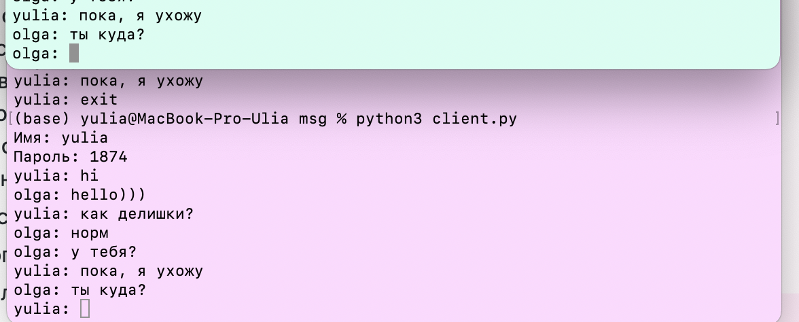
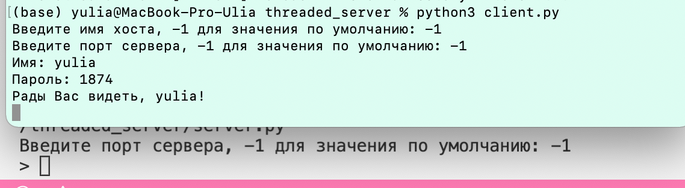
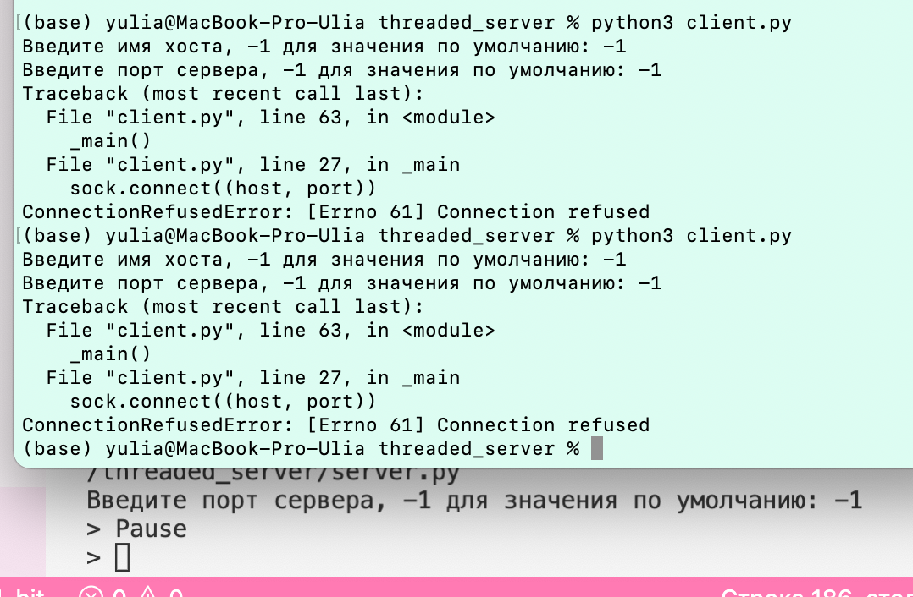
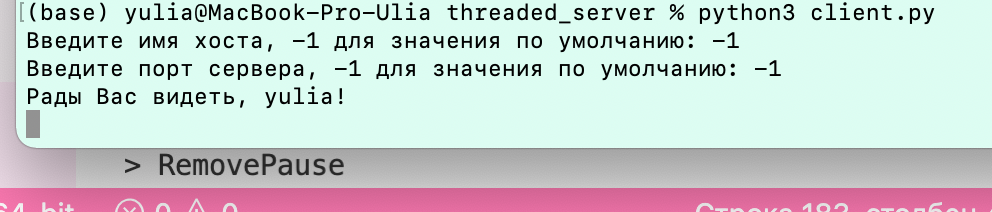
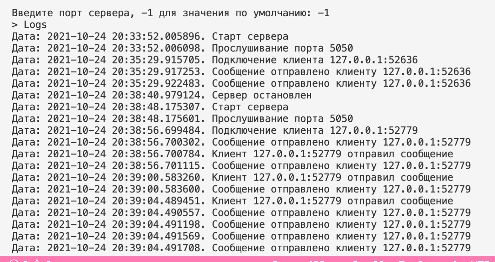
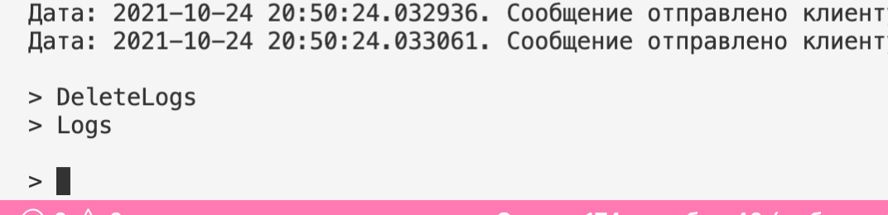
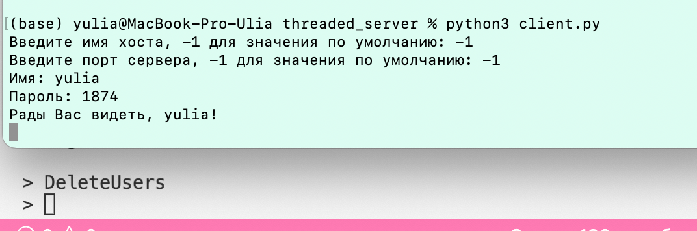

## Создание простого многопоточного сервера

### Цель работы

Познакомиться с приемами работы с многопоточностью на примере создания сокетного TCP-сервера, способного работать с несколькими клиентами одновременно

### Задания:

1. Модифицировать простой эхо-сервер таким образом, чтобы при подключении клиента создавался новый поток, в котором происходило взаимодействие с ним.

2. Реализовать простой чат сервер на базе сервера аутентификации. Сервер должен обеспечивать подключение многих пользователей одновременно, отслеживание имен пользователей, поддерживать историю сообщений и пересылку сообщений от каждого пользователя всем остальным. 

    
    
    
    
3. Реализовать сервер с управляющим потоком. При создании сервера прослушивание портов происходит в отдельном потоке, а главный поток программы в это время способен принимать команды от пользователя. Необходимо реализовать следующие команды:
    
    
    
    1. Отключение сервера (завершение программы);
    
    
    
    2. Пауза (остановка прослушивание порта);
    
    
    
    
    
    3. Показ логов;
    
    
    
    4. Очистка логов;
    
    
    
    5. Очистка файла идентификации.
    
    
